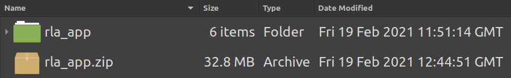
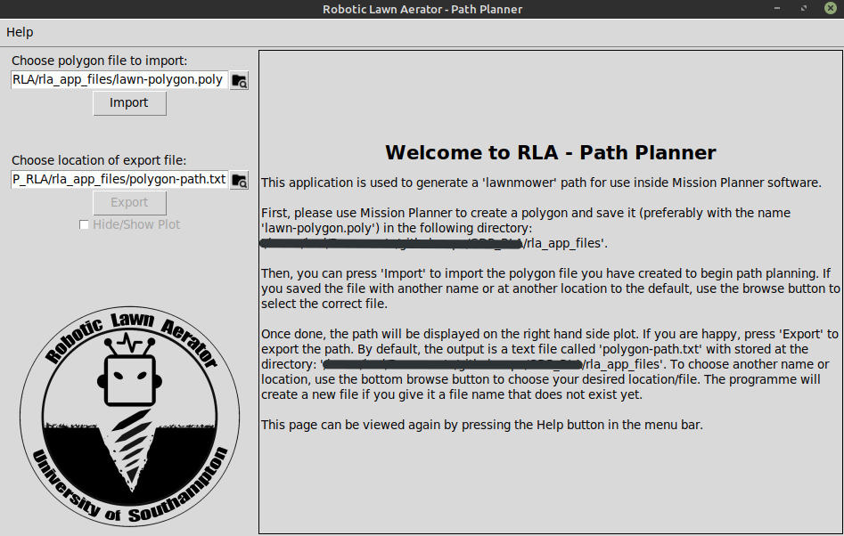
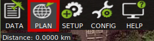
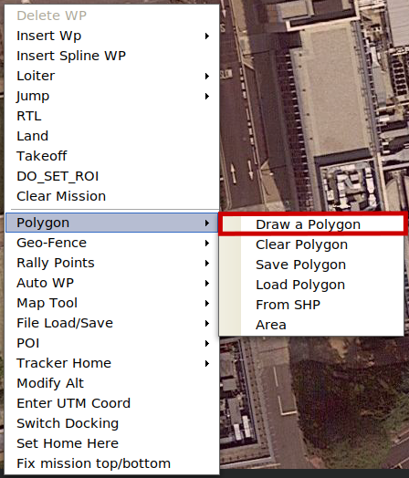
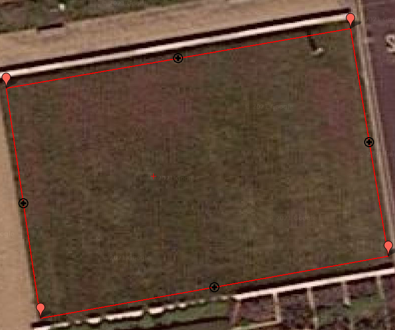
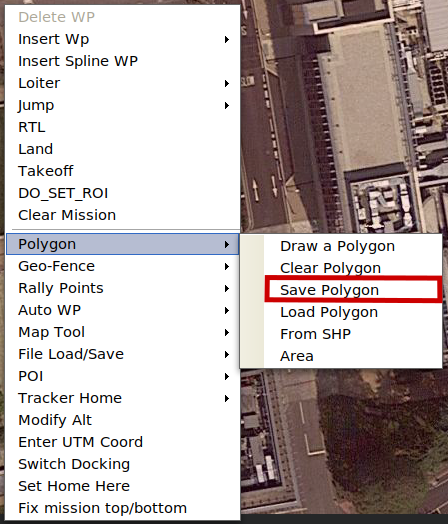
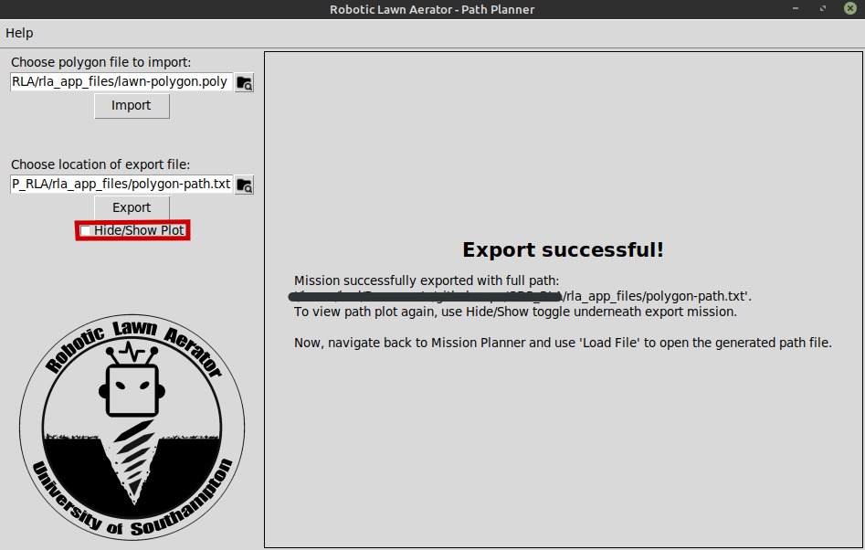
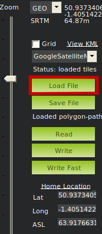
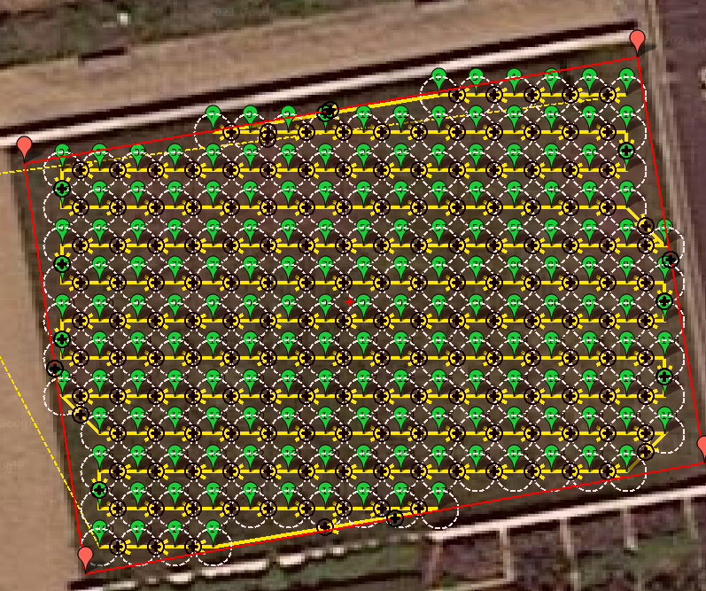
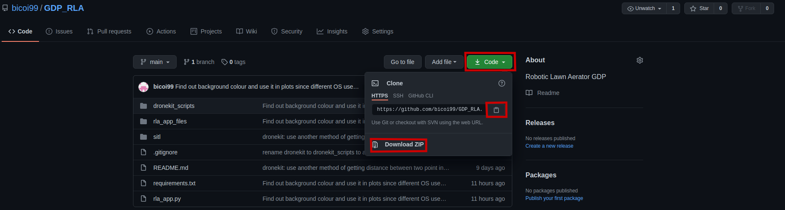

# GDP_RLA

This is the repository for the project Robotic Lawn Aerator, a University of Southampton Group Design Project, and is maintained by Huy Duong.

## Table of Contents

- [About](#about)
- [RLA App](#rla-app)
  - [Installation](#installation)
  - [Usage](#usage)
  - [Report Bugs](#report-bugs)
  - [Install and run from source code](#install-and-run-from-source-code)
  - [Compiling from source](#compiling-from-source)
- [Software In The Loop](#software-in-the-loop)
- [Dronekit](#dronekit)
- [Setup Raspberry Pi](#setup-raspberry-pi)

## About

Our goal is to create a robot that autonomously aerate any patch of lawn.

We use a Cube Black (Pixhawk 2.1) as our autopilot to carry out GPS navigation. Lawn aeration is carried out by drilling into the ground so that hard and dry lawns can still be cared for. We use an Arduino to control a DC motor driving an array of Auger drill bits as well as a stepper motor driving a linear actuator for vertical motion. The link between the Arduino and the Cube is established by a master Raspberry Pi.

This repo main purpose is to provide a guide on how to use download, install and use our RLA Path Planner app alongside Mission Planner to plan out a "lawnmower" path on any patch of lawn. Therefore, you can check out [RLA App](#rla-app) section for more details.

Additionally, you can also find utilities scripts for starting up SITL (virtual vehicle), drill Arduino and Raspberry Pi dronekit code. Use the [Table of Contents](#table-of-contents) above to navigate to the interested sections.

## RLA App

### Installation

You can download the ZIP file for the latest **RLA Path Planner** release of the the app [here](https://github.com/bicoi99/GDP_RLA/releases/download/v1.1/rla_app.zip) or in the Release tab. After downloading, unzip/extract the `rla_app.zip` file to a location of your choice (I recommend your `Documents`) to see a `rla_app` folder.



Navigate inside the folder, find and double click `rla_app.exe` (it should have the RLA logo icon next to it) to open up the app. The first time it opens, it should take a few seconds so be patient but you should see the main screen like the picture below. The picture is taken on Linux so yours will not look exactly the same but should have the same layout. I am hiding my system path for security reasons but it should display the absolute path to the files on your system (different to mine but should end with `rla_app_files` folder).



**Important** - the way the app is packaged, the executable `rla_app.exe` requires all items within the `rla_app` folder to function properly (especially the `rla_app_files` subfolder). If you want to change the location that the app is installed at, make sure you move the entire `rla_app` folder.

*Alternatively, you can build the app from source if you have Python. Instructions can be found in [Install and run from source code](#install-and-run-from-source-code)*.

Now your RLA app installation is complete but it is to be used together with **Mission Planner** software. The latest version can be found along with its installation guide [here](https://ardupilot.org/planner/docs/mission-planner-installation.html).

Please download both RLA Path Planner and Mission Planner before proceeding to the sections below.

### Usage

We start our path planning with creating a **polygon** outlining the patch of lawn. Open Mission Planner software to the `PLAN` tab and navigate the map to your location (The example is done at Boldrewood campus).



Once at the correct location, right click on the map and select `Polygon > Draw a Polygon`.



Left click on the map to assign polygon verticies/corners. You can drag and drop to change position or right click on a polygon and `Delete WP` to delete an unwanted vertex.



Right click and and select `Polygon > Save Polygon`. Save the .poly file to your desired location or the location stated in the RLA app start screen (inside `rla_app_files` folder with the name `lawn-polygon.poly`).



You can now return to the opened **RLA Path Planner** app. The app is fully documented with help text to guide you through the process.

*For testers: this is exactly what I want to get feedback on, whether or not the help text is sufficient and helpful. If you spot anything that is unclear, buggy, crashing, let me know so I can improve it.*

After you finish using the app, it should show this end screen. Use the `Hide/Show` button to re-display the plot so you can compare with what you will import to Mission Planner.



With the path of the generated the mission file, go back to **Mission Planner** and press `Load File` on the right hand side. Load the file that you saved in RLA app (default is `polygon-path.txt` in the same folder as `lawn-polygon.poly`).



The correct path should be loaded into Mission Planner.



From here you can proceed as if it is a normal mission. Upload to the vehicle so that it can carry out AUTO mission or GUIDED mode mission.

### Report bugs

The app is still under development so please do come back to me if you find any bugs at all. Any is welcomed!

### Install and run from source code

#### Python and virtual environments

To run the source code, you need Python 3 or above (the app is developed in Python 3.8.5). If you do not have Python, use [this](https://realpython.com/installing-python/) guide to install Python on your operating system.

When using Python, it is good practice to use a virtual environment for every project (find out why [here](https://realpython.com/python-virtual-environments-a-primer/)), so here I will explain how you can setup your virtual environment. This is optional such that you can just as easily use your normal system Python to run the app. In that case, just skip this section.

If you are sticking around, open up a Terminal (or Command Prompt) session and navigate to your `Documents` directory. **N.B.** a new folder will be created here to store all created Python environments so change where you want to make this this folder if you do not want to cluster your Documents folder. Now we need to create a folder called `pyvenv` to store all our created Python environments as mentioned above by typing:

```bash
mkdir pyvenv && cd pyvenv
```

The `cd` commands lets you go inside the `pyvenv` folder. Once in, you can create a new environment called `rla` with:

```bash
python3 -m venv rla
```

If that does not work then try replacing `python3` with `python`. Accept the options and a virtual environment is created called `rla`. To activate it, use:

```bash
source rla/bin/activate
```

Now a `(rla)` should appear to the left of your current line in the Command Prompt indicating a virtual environment is active. You can access a brand new empty Python session by typing `python`. If you see Python console `>>>` showing, you have successfully installed a new Python virtual environment.

If you have Anaconda installed, creating new environment is explained [here](https://docs.conda.io/projects/conda/en/latest/user-guide/tasks/manage-environments.html).

#### Getting the source code

To run the app you need to download the source code from the repository. At the top of the page, click the green `Code` button. You can either download the ZIP folder, extract and copy the entire GDP_RLA folder to a place of your choice. Or you can copy the HTTPS link and use git to clone the repo to your wanted location.



To do the second option, open up Terminal or Command Prompt, navigate to the location you want the code to be in and type: `git clone https://github.com/bicoi99/GDP_RLA.git` and the repo will be automatically cloned to that location. This will require you to have git installed (contact me if you need help) so if you do not want to deal with the hassle, just download ZIP file.

#### Install required Python packages

Before running however, there are some dependency packages or library that you also need to install. First, navigate using Terminal inside the GDP_RLA folder that you have downloaded above. Type `ls` (for Mac) or `dir` (for Windows) to list out all the files inside the folder and check with the GitHub page that you have all the relevant files and folders including `requirements.txt` file. Next, you can install all required Python libraries for the RLA app with the command:

```bash
pip install -r requirements.txt
```

After the automatic install is completed, you will have installed: `matplotlib` (`numpy` along with it). Currently, only `matplotlib` is required but as the app grows more dependecies will be needed.

#### Running the app from source

Now you are ready to run the app from source, just type and a window will pop up identical to running the executable:

```bash
python rla_app.py
```

### Compiling from source

`pyinstaller` is used to compile the Python code into an executable to distribute. The `rla_app.spec` file contains the compile settings. Run the following command to build the code:

```bash
pyinstaller rla_app.spec
```

Some options that you might be interested in in the spec file:

- `added_files` list ensures `rla_app_files` folder is carried over in the compilation.
- `os` module is used to get the working directory so it should work on any machine. If you have problems, just manually type in the path of the `GDP_RLA` folder.
- `console` flag is set to `False` to ensure no console pops up when executable is ran. `--noconsole` or `--windowed` or `-w` flags are alternatives to this when you run `pyinstaller` on `rla_app.py` itself.
- `icon` flag points to the `.ico` file. This is to include the RLA logo with the compiled programme. Alternative flags are `--icon` or `-i`.

## Software In The Loop

**Due to time constraint, I unfortunately have not completed this section yet so use it for reference only. I will finish the section as soon as I have the time so you can follow along and install SITL on your machine.**

Here is a guide of how to setup SITL for Linux or Linux Virtual Machine (VM) running on Windows.

### Prerequisites

This assumes some prior knowledge of Python, Linux and Shell scripting.

### Setting up a Linux VM

Follow [this](https://itsfoss.com/install-linux-in-virtualbox/) guide to setup Linux using Oracle VirtualBox.

- You can use any distribution of Linux, but this guide uses Ubuntu 20.04 LTS.
- Ensure you enable SVM in your BIOS (AMD-V for AMD CPUs)

`sudo apt update && sudo apt upgrade` to update everything on your Linux after you finish setting it up following the guide.

### Setup and activating SITL

This is Huy version of the following [guide](https://ardupilot.org/dev/docs/setting-up-sitl-on-linux.html).

First, you need to setup a build environment for ardupilot. Use [this](https://ardupilot.org/dev/docs/building-setup-linux.html) to setup on Ubuntu. Only follow the first section of the guide i.e. stop before _Setup for other Distributions Using the STM Toolchain_ section. Keep a note of where you save ardupilot folder, this is where SITL is going to be activated from.

To start the SITL simulation, you need to select the correct vehicle type. This is done by navigating to the appropriate folder. For RLA, we use Rover firmware so change directory to the correct folder:

```bash
cd ardupilot/Rover
```

The first time SITL gets activated (by running the script `sim_vehicle.py`), it will build itself first which takes 3-5 minutes so be patient (it will only need to build once and subsequent activation will be faster). SITL stores parameters in a virtual EEPROM in the file `eeprom.bin` (can be found in `ardupilot/Rover` directory). So, when you run SITL for the first time you need to wipe this to initiate default params. Use the following command with the flag `-w` to wipe EEPROM:

```bash
../Tools/autotest/sim_vehicle.py -w
```

After the first run, kill the current session with the keyboard interupt `Ctrl+C`. Now you can start the simulation the same way you will do it in any subsequent session by typing into the terminal:

```bash
../Tools/autotest/sim_vehicle.py
```

Now a virtual Rover is simulated on the machine but in order to tap into that virtual vehicle (using MissionPlanner or any GCS for mission planning) you need to use MAVProxy. This is a GCS (Ground Control Station) on its own and you can do a lot of testing with it but it has the ability to forward messages of the vehicle over the network via UDP, meaning you can connect to your simulated Rover using MissionPlanner, the software that RLA mainly uses to calibrate, control the Cube (the real Rover). You can learn more about MAVProxy from the [documentation](https://ardupilot.org/mavproxy/index.html) but here only a few options and commands are required. MAVProxy options can be activated through flags passed to the `sim_vehicle.py` script. Flags can just be typed straight after the script call shown above, many can be used at the same time, just write one after another, so pick and choose your flavour.

The most important one is `-h` this shows all options that `sim_vehicle` can take:

```bash
../Tools/autotest/sim_vehicle.py -h
```

MAVProxy has a builtin map and GUI console that can be activated as follows:

```bash
../Tools/autotest/sim_vehicle.py --map --console
```

SITL initiates at a fixed location (somewhere in the US) and to bring your vehicle to a location of choice, you can use `-L` tag. However, the argument passed has to be the name of the location. You need to make this location in a file found at `ardupilot/Tools/autotest/locations.txt`. The format of this file is each line a location specifed as `NAME=latitude,longitude,absolute-altitude,heading`. Latitude, longitude can be found using Google Maps, absolute-altitude can be any value since Rover ignores altitude and heading is the direction that the vehicle faces at startup. Inside the `sitl` folder of this repository, there is a `locations.txt` file that have the Boldrewood input that you can append to local `locations.txt` file.

```bash
../Tools/autotest/sim_vehicle.py -L <NAME>
```

Now to tackle the MAVProxy capability to forward the vehicle. As default, SITL use MAVProxy to give out 2 outputs `127.0.0.1:14550` and `127.0.0.1:14551` (you can check this by looking at the messages shown after calling `sim_vehicle`). However, unless you have you simulated vehicle and MissionPlanner running on the same machine (not via VM), `localhost` or `127.0.0.1` is not accessible. Rather, the IP address should be used. You need to find the IPv4 Address of your Linux VM by opening the Command Prompt in Windows and type `ipconfig`. Once this is found, the following flags can be used to broadcast to UDP port 14550 (`--no-extra-ports` disable the two default ports which is optional, but I just disable them to avoid any mistakes):

```bash
../Tools/autotest/sim_vehicle.py --no-extra-ports --out <VM-IPv4-Address>:14550
```

In the `sitl` folder of this repo, the `rover-sitl.sh` shell script is available for you to use which automatically turn activate SITL with correct flags when ran. Put this file to the `ardupilot` folder on your Linux VM. Navigate to this folder and type:

```bash
bash rover-sitl.sh
```

Now you can use your simulated Rover either using MissionPlanner by connecting to UDP 14550 or test directly on MAVProxy.

### Using MAVProxy

### Files

- `install-prereqs-mint.sh` is modified script to install prerequisites for Linux Mint 20 (ulyana)
- `locations.txt` file stores the custom location for SITL to start from. This might become uncessary cause the SITL activation script can take care of this on its own
- `rla.parm` is the parmeter file to load in SITL, this only needs to be loaded once because the virtual eeprom can store parms afterwards
- `rover-sitl.sh` is the script to launch SITL from this folder.
- `wsl-rover-sitl.sh` is the script that is previously used inside of Windows WSL

## Dronekit

**Due to time constraint, I unfortunately also have not completed this section so use it for reference only but the code is up to date. I will finish the section as soon as I have the time so you can follow along and test dronekit.**

Communication between the autopilot and the microprocessor that controls the aeration mechanism is not straight forward. The use of a master Raspberry Pi is being investigated and Dronekit is a Python API that allows a companion computer to control the Pixhawk.

Dronekit runs on Python 2 and yet to have support for Python 3 so you need to install this on your system. I recommend Anaconda for easy virtual environment if you run the scripts on you Windows machine. But if you run the script on a VM Linux then you should install Python 2 individually as Anaconda is heavy.

## Mini drill experiment

**Due to time constraint, I unfortunately also have not completed this section so use it for reference only but the code is up to date. I will finish the section as soon as I have the time so you can follow along and build your own mini drill setup.**

This is an experiment that I setup to demonstrate the functionality of Pi-Cube-Arduino link. I showed that the Pi can sequentially send GPS coordinates to Cube/SITL and Arduino (serial UART) so that drilling and motion do not obstruct each other. You can watch the demonstration [here](https://drive.google.com/file/d/1Q-LO6JHBYd_n-rem3zJVR_wO7Mw84Pu0/view?usp=sharing).

The Arduino code can be found in `rla-mini-drill` folder. This is a PlatformIO project so make sure you have that installed in VSCode to use. However the code can be ran on the Arduino IDE as well, the file is found in `src/main.cpp`.

## Setup Raspberry Pi

Connecting to flight controller and GCS:
- MAVProxy install [instructions](https://ardupilot.org/mavproxy/docs/getting_started/download_and_installation.html) (Linux Python 3 version).
- Set up flight controller params and Pi serial ports [instructions](https://ardupilot.org/dev/docs/raspberry-pi-via-mavlink.html). Make sure baudrate is 57600 rather than recommended.
- Enable UDP connection through port 14550 in firewall. Google for instructions for Linux or Windows as necessary.
- SSH into the Pi and run `mavproxy.py --master=/dev/serial0 --baudrate=57600 --out=<computer_IP>:14550`.
- Open Mission Planner and everything should be conneced

Dronekit:
- Official install [instructions](https://dronekit-python.readthedocs.io/en/latest/guide/quick_start.html).
